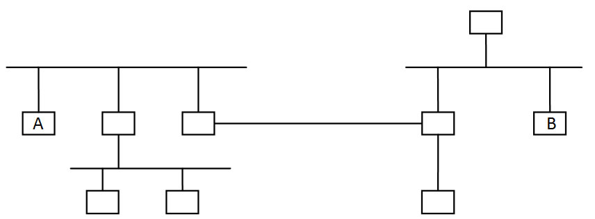

# 计算机网络理论练习题 - 作业 1

作业名称：作业1

作业描述：概述

总题数：49

## 习题及答案

1. 下面图中从主机A到主机B有多少经过多少个直连网？

   

   A. 3 
   B. 4
   C. 5
   D. 6

   Answer:
   A

2. 无线电台使用了哪种多路复用技术?
   A. Time Division Multiplexing
   B. Frequency Division Multiplexing
   C. Statistic Multiplexing
   D. Code Division Multiplexing

   Answer:
   B

3. 哪种网络一般采用多路访问链路？
   A. SAN
   B. LAN
   C. MAN
   D. WAN

   Answer:
   B

【未完待续】

