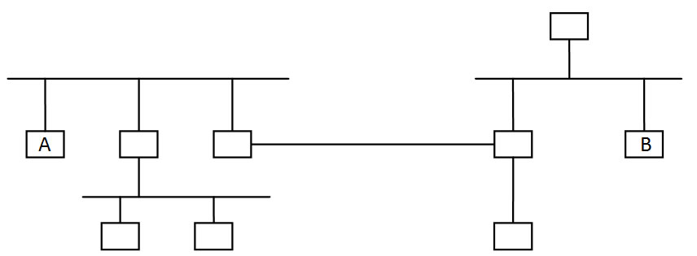
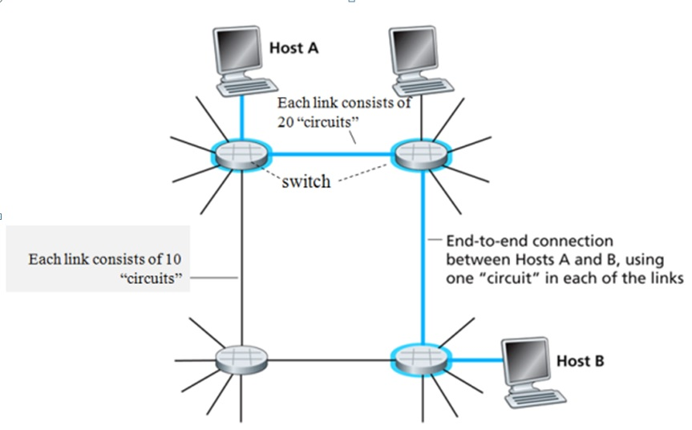

# 计算机网络理论练习题 - 作业 1

作业名称：作业1

作业描述：概述

截止时间：2019/3/18 22:59:59

总题数：49

## 习题及答案

1. 下面图中从主机A到主机B有多少经过多少个直连网？

   

   A. 3 

   B. 4

   C. 5

   D. 6

   Answer:
   A

2. 无线电台使用了哪种多路复用技术?

   A. Time Division Multiplexing

   B. Frequency Division Multiplexing

   C. Statistic Multiplexing

   D. Code Division Multiplexing

   Answer:
   B

3. 哪种网络一般采用多路访问链路？

   A. SAN

   B. LAN

   C. MAN

   D. WAN

   Answer:
   B

4. 多播的通信方式是指什么?

   A.一对一

   B.一对多

   C.一对所有

   D.多对一

   Answer:
   B

5. 每个时刻一个站点发送一个站点接收的通信方式是指什么?

   A.multicast

   B.unicast

   C.broadcast

   D.anycast

   Answer:
   B

6. 把许多网络连成的网络称为什么?

   A.internetwork

   B.the Internet

   Answer:
   A

7. 通常使用以下哪种设备连接多个网络来形成更大的网络?

   A.hosts

   B.cellphones

   C.routers

   D.repeaters

   Answer:
   C

8. 电话使用了以下哪种传输方式?

   A.full-duplex

   B.half-duplex

   C.simplex

   D.none

   Answer:
   A

9. 实验室一般采用以下哪种连网方式?

   A.SAN

   B.LAN

   C.MAN

   D.WAN

   Answer:
   B

10. 因特网属于以下哪种网络?

    A.SAN

    B.LAN

    C.MAN

    D.WAN

    Answer:
    D

11. 下面的电信模式分别使用了什么服务类型? （填可选项的字母）

    普通邮件（    ）

    电话（    ）

    快件（    ）

    可选项：A.无连接有确认服务；B.面向连接的服务；C.尽力服务(无连接无确认)  

    Answer:
    CBA

12. 手机属于因特网的哪个部分?

    A.end systems

    B.communication links

    C.routers

    Answer:
    A

13. WiFi属于以下哪个部分?

    A.network core

    B.access network

    C.network edge

    Answer:
    B

    Explanation:

    network core -- 主干网

    access network -- 接入网

    network edge -- 网络边界(主机及网络程序)

14. 电话系统使用了以下哪种交换方式？

    A.circuit switching

    B.packet switching

    Answer:
    A

15. 与电路交换技术相比，以下哪些是包交换技术的特点?（多选）

    A. 可以确保数据流带宽

    B. 可能引起网络拥塞

    C. 适合发送突发数据

    D. 有呼叫建立过程

    Answer:
    BC

16. 如果有8个速率相同的数据流，且它们速率之和小于且接近一条链路的带宽，与用8个通道(channel)的TDM或FDM传送它们相比，采用统计多路复用技术的带宽利用率(传送有效数据的比率)怎么样？

    A.更好

    B.更差

    C.一样

    D.不一定

    Answer:
    B

    Explanation:
    都可以用完整个带宽，只是统计复用技术需要地址，因此会差一点

17. 一般网络体系结构(OSI参考模型)和TCP/IP体系结构分别把网络协议分为几层？（填数字）。

    Answer:

    OSI-7,TCP/IP-4或5

    Explanation:

    OSI参考模型中的七层协议的会话层和表达层在TCP/IP体系结构都放在应用层，如果再把链路层和物理层放在物理网络层，加上网络层和传输层，TCP/IP体系结构就是四层。如果链路层和物理层分开看就是五层。最低两层可以合并起来看是因为TCP/IP协议并不定义链路层和物理层的协议。

18. 结点到结点(node-to-node)或跳到跳(hop-by-hop)、主机到主机(host-to-host)和端到端(end-to-end)的传输分别由哪层完成？

    Answer:

    数据链路层，网络层，传输层

    Explanation:

    数据链路层完成结点到结点(node-to-node)的数据传输，就是从一个节点通过直连网把数据传送到另一个节点，也称为实现跳到跳(hop-by-hop)的数据传送。网络层完成主机到主机(host-to-host)的数据传输，就是可以把数据从网络中的一台主机传送到网络中的另一台主机。把数据传到主机还不行，还需要传送到进程，这是由传输层完成的，如果把进程看成整个数据传送的末端，则传输层实现了端到端的传送。

19. 数据链路层负责什么工作?

    A.routing

    B.transfering bit stream on a wire

    C.transfering packets in a physical network

    D.transfering data between processes

    Answer:
    C

20. 加密解密是OSI参考模型的哪一层的功能?

    A.Network

    B.Presentation

    C.Transport

    D.Session

    Answer:
    B

21. FTP协议属于OSI参考模型的哪一层?

    A.Transport

    B.Application

    C.Presentation

    D.Network

    Answer:
    B

22. 因特网的传输层、网络层、数据链路层的数据包的专用名称分别是什么？(填可选项的字母)

    可选项： A.frame B.segment C.bit D.datagram

    Answer:
    BDA

23. OSI模型的哪一层负责多个数据流同步?

    A.Network

    B.Transport

    C.Session

    D.Presentation

    Answer:
    C

24. 一条链路的带宽(bandwidth)一定大于等于其吞吐量(throughput)，这句话是否正确？

    A.正确

    B.错误

    Answer:
    A

25. 对等实体之间传输的数据包简称为什么?

    A.PCI

    B.SAP

    C.PDU

    D.SDU

    Answer:

    C

    Explanation:

    对等实体(peer entity)指实现了同一个协议的软件或硬件。PCI（Protocol Control Information）是PDU（Protocol Data Unit）的头部，包含协议有关的信息。下层把上层通过SAP（Service Access Point）传来的SDU（Service Data Unit）用PCI封装为PDU后传给对等实体。

26. 因特网的三个组成部分为end system,（    ）和（    ）。

    Answer:
    communication links, routers

27. 一条点到点链路长200公里，传播速度为2×10^8米/秒。如果发送一个100字节的包，以多少带宽(bps)它的传播延迟(propagation delay)会等于其传输延迟(transmit delay)?（只写最后结果，单位为Kbps）

    Answer:

    800

    Explanation:

    8 * 100 / X（bps） = 200*1000/（2×10^8）= 1 / 1000

    X = 800000bps = 800Kbps

28. 一条点到点链路长200公里，传播速度为2×10^8米/秒，带宽为100Mbps。发送一个20000比特的包通过该链路需要多长时间(ms)? 考虑从第一位发送到收到最后一位的时间。（只填最后结果的数值，单位为ms）

    Answer:

    1.2

    Explanation:

    200000/200000000+20000/100000000=1ms+0.2ms = 1.2ms

29. 如果一个长度为3000字节的文件用一个数据包从源主机通过一段链路传给了一个交换机（采用store-and-forward方式),然后再通过第二段链路到达目的主机。如果在包交换机的延迟为2ms, 两条链路上的传播延迟都是2×10^8米/秒,带宽都是1Mbps, 长度都是6,000公里。问这个文件在这两台主机之间的总延迟是多少？

    Answer:

    110ms

    Explanation:

    (3000*8/1000000 s + 6000000/2*10^8 s)* 2  + 2ms
    = (24ms+30ms)*2+2ms = 110 ms

30. 如果把上面题目中的文件分成10个数据包。问传送这个文件的整个延迟是多少? 

    Answer:

    88.4ms

    Explanation:

    第一个包的整个延迟+剩余包的接收延迟（或发送延迟）

       *-----+-----&      +  2ms
      *-----+-----&       *  发送延迟

     *-----+-----&        &  接收延迟

    *-----+-----&         -  传播延迟

    300*8/1000000 * 2 s + 2ms + 6000000/2*10^8*2 s + 9 * 300*8/1000000 s = 11*2.4ms + 2ms+ 60ms = 88.4ms

31. 如果在上面题目中，只采用一个包发送整个文件，并且包交换机不采用存储转发技术(收到整个包才转发)而采用收到一位立即转发一位。问传送这个文件的整个延迟是多少?

    Answer:

    84ms

    Explanation:

    整个文件的发送延迟+传播延迟+1位转发延迟（忽略）

    3000*8/1000000 s + 6000000/2*10^8 s * 2
    = 24ms+30ms*2 = 84ms

32. 什么是模拟信号？

    A.signal with continuous information

    B.signal with digital information

    C.discrete signal

    D.signal with continuous waveform.

    Answer:
    D

33. 下面哪种编码同时调制了相位和振幅？

    A.ASK

    B.PSK

    C.QAM

    D.FSK

    Answer:
    C

34. 时钟漂移主要是因为什么原因引起的？

    A.发送方和接收方使用了相同的时钟信号

    B.发送时短时间就会出现校正信号

    C.发送方和接收方使用了不同的时钟信号

    D.发送时长时间没有包含校正信号

    Answer:
    CD

35. 基线漂移主要是因为什么原因引起的？

    Answer:
    长时间传输相同电平的信号导致链路上的同种电荷不断累积，最后导致信号整体偏离了基准线。

36. 下面哪种编码可以克服时钟漂移和基线漂移？

    A.单级编码

    B.PSK

    C.不归零反转编码

    D.曼彻斯特编码

    Answer:
    D

37. 利用起始是否跳变区分0和1而且中间必须跳变的编码是哪种？

    A.不归零编码

    B.差分曼彻斯特编码

    C.不归零反转编码

    D.曼彻斯特编码

    Answer:
    B

38. 如果二进制数据10011001的曼彻斯特编码的数字信号用0110100101101001（1和0分别表示正电压和负电压信号，并持续相同时间长度）表示，问：10101100的曼彻斯特编码的数字信号表示是什么(中间不要加空格和其他符号)？

    Answer:
    0110011001011010

39. 如果采用与上题类似的方法表示差分曼彻斯特编码，并且从高电平开始，二进制数据10101100的差分曼彻斯特编码的数字信号表示是什么(中间不要加空格和其他符号)？

    Answer:
    1010010110010101

40. 要发送的数据采用4B/5B编码最多会出现多少个连续0？ 二进制数据1001100110101100的4B/5B编码是什么(中间不要加空格和其他符号)？

    Answer:
    3，10011100111011011010

41. 网络传输主要会使用哪些有线物理介质?

    Answer:
    双绞线, 同轴电缆, 光纤

42. 光纤传输利用了光的什么特性？

    A.reflection

    B.refraction

    C.total reflection

    D.total refraction

    Answer:
    C

43. 下面哪种光纤具有最大的数据传输速率?

    A.single-mode fiber (单模光纤)

    B.step-index multimode fiber(阶跃多模光纤)

    C.graded-index multimode fiber(渐变多模光纤)

    Answer:
    A

44. 下面哪种非屏蔽双绞线(unshielded twisted pair, UTP)最适合千兆以太网使用?

    A.cat3

    B.cat4

    C.cat5

    D.cat6

    Answer:

    D

    Explanation:

    cat6（六类）UTP就是千兆以太网的标准UTP

    cat5用于100Mbps以太网

    **t5e（超5类）可以用于百兆或千兆以太网。**
45. 假设用户共享一个2Mbps的链路，并且每个用户在传送数据时都需要200Kbps的带宽，如果使用电路交换，最多几个用户可以共享这个链路? 

    **Answ:**
    10**

. 上面问题采用包交换技术，让30个用户共享这个链路，每个用户只有20%的时间在发送数据。问有6个用户同时发送的概率是多少？(Hint: Use the binomial distribution.) 

    **Answer:*

    约为18%**
    Explanatn:**

    任何时刻一个用户的概率为20%，不发送的概率为80%。30个用户中有6个用户发送的概率为：**

    C(30,6) 0.2^6 * 0.8^24**

    =593775 0.000064 * 0.004722366482869645213696**

    = 0.17945**

47. 12个包同时到达包交换机的输出接口，此时并没有任何包在此输出接口处发送或排队。如果每个数据包的长度都是300字节，该接口的带宽为1Mbps。这些数据包的平均排队延迟是多少?

    **Answer:*

    13.2ms**
    Explanatn:**

    每个包的发送时间00bytes/1Mbps，即2.4ms。**

    第一个排队时间为第二个包的排队时间为1*2.4ms，...，第12包的排队时间为11*2.4ms。因此，平均排队时间为：**

       **(0+……+112.4/12 =66*2.4ms/12=13.2ms**

48. 下图中的电路交换网络。如果每条垂直链路用FDM或TDM分成10个电路，每个水平链路分成20个电路。这个网络最多可以建立多少个并发连接？

    

    **Answer:*

    60**

  Explanatn:**

    按照上课所讲，这设电脑与交换机采用专线，电脑足够多。每条电路可以形成一个连接，共有10+10+20+20=60个电路，因此最多可以形成60个并发连接。**

49. 面问题中,假设所有的连接都是左上角到右下角。这个网络最多可以建立多少个并发连接？

    **Answer:*

    20**

  Explanatn:**

    每个连接或者是一平线接一条垂直线或者是一条垂直线接一条水平线，最多可以建20个这样的连接。**
