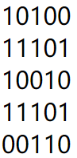

# 计算机网络理论练习题 - 作业 2

作业名称：作业2

作业描述：数据链路层

截止时间：2019/3/24 23:00:00

总题数：24


## 习题及答案

1. 数据链路层的功能是负责在（    ）中传输数据帧。

   ```
   Answer:
   物理网络
   ```

   

2. 以下哪些是数据链路层的功能?
   A.framing

   B.error detection

   C.error control

   D.routing

   E.medium access control

   F.encryption

   ```
   Answer:
   ABCE
   ```

   

3. 以下为收到的带有二维奇偶校验码(偶校验)的数据:

   

   请问哪个位置的比特出错了？

   A.row 1 col 2

   B.row 5 col 4

   C.row 4 col 3

   D.row 4 col 2

   ```
   Answer:
   D
   ```

   

4. 二维奇偶校验码是否可以检出所有的两位错误？

   A.可以

   B.不可以

   请证明你的结论。

   ```
   Answer:
   A
   
   Explanation:
   如果这两位错在同一行，则会有两列发现错误，如果不在同一行，则会有两行发现错误。
   
   -------------------------
   我的答案：
   可以。
   假设二维奇偶校验用于的数据序列可以划分为m*n的矩阵，m>=2，n>=2。所有的两位错误可以分为如下三类进行讨论：
   1. 两位错误位于同一行。此时，所有的行校验码不变；而发生错误的两位所在的列将校验失败，因此可以检测出（但不能纠正）。
   2. 两位错误位于同一列。此时，所有的列校验码不变；而发生错误的两位所在的行将校验失败，因此也可以检测出（但不能纠正）；
   3. 两位错误既不在同一行，也不在同一列。对于任一错误的位，其所在的行和列都将校验失败，因此不但可以检测出错误，还可以纠正这种错误。
   
   综上所述，二维奇偶校验码可以检出所有的两位错误。
   ```

5. 根据下面给出的二维奇偶校验码证明二维奇偶校验码不能纠正两位错误。

   

   ```
   Answer:
   任何一行两位出错，都只能发现哪两列有错，但是不能确定它们在哪一行。
   
   -------------------------
   我的答案：
   如果两位错误出现在同一行或同一列，则无法纠正。
   
   举一个反例：第1行的最后两列（第4、5列）由00变成11，也就是说变为：
   10111
   11101
   10010
   11101
   00110
   注意到这种情况下，第一行的奇偶校验码与原先相同。二维奇偶校验码只能发现错误出现在最后两列，但不能准确定位到是哪两个比特出现错误，因此也就不能纠正两位错误。
   ```

6. 数据(十六进制)8AE4B578E0E6EE03的检验和是什么? 

   ```
   Answer:
   F0B7
   
   Explanation:
   按16位加起来，进位加到结果中去。
   ```

7. 数据为110101101100011011(D)，除数(G)为10011, CRC校验码(R)是什么？(二进制) 

   ```
   Answer:
   1000
   
   Explanation:
   1101011011000110110000   （后面加的0的个数比除数位数少1）
   10011
    10011
    10011
         10110
         10011
           10100
           10011
             11111
             10011
              11000
              10011
               10111
               10011
                 10010
                 10011
                     1000
   ```

8. 如果当前RTT=1ms，采用选择性重传(selective repeat)滑动窗口协议，超时时间应设置为略大于（    ）ms；如果收到NAK就重置所有的超时定时器，那超时时间应设置为略大于（    ）ms。 

   ```
   Answer:
   2，1
   
   Explanation:
   这里假设收到NAK的重传不重置超时定时器，否则，一个RTT也可以。
   
     
   ```

9. 如果滑动窗口协议的发送窗口大小为42，当前有20帧发送出去了但未收到确认, 问有新的确认帧到达前还可以发送多少帧? 

   ```
   Answer:
   22
   ```

10. 把停等协议用于一个带宽为20Mbps、长度为3000公里、传播速度为200000公里/秒的点到点链路，如果最长帧为5000字节，带宽的最大利用率(最大吞吐量/带宽)是百分之多少? 

    ```
    Answer:
    6.25
    
    Explanation:
    最大吞吐量：5000*8/(5000*8/20M+2*3000/200000)=40000/(2ms+30ms)=1.25Mbps
    
    1.25/20=6.25%
    ```

11. 如果上题改为滑动窗口协议，发送窗口大小为8，带宽的最大利用率(最大吞吐量/带宽)又是百分之多少? 

    ```
    Answer:
    50
    
    Explanation:
    最大吞吐量：5000*8*8/(5000*8/20M+2*3000/200000)=320000/(2ms+30ms)=10Mbps
    
    10/20=50%
    ```

12. 如果使用回退N滑动窗口协议，发送窗口大小为4，可以循环使用的序号为0~7，RTT大于4帧的发送时间。如果发送方发送了从序号3开始的10个数据帧，除了第2帧（序号为4）和第5帧（序号为7）丢失，包含重传帧在内的其它帧均正确到达接收方，问接收方依次收到这些帧（含重传帧）的序号（序号之间用一个空格隔开）。

    ```
    Answer:
    3 5 6 4 5 6 7 0 1 2 3 4
    ```

    
