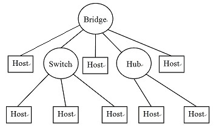
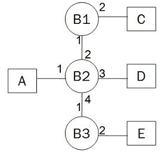
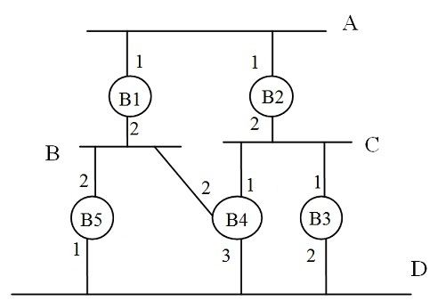
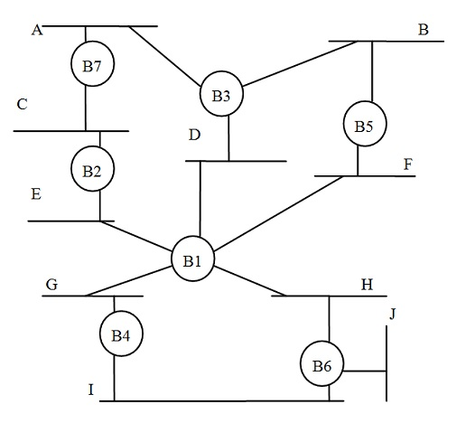
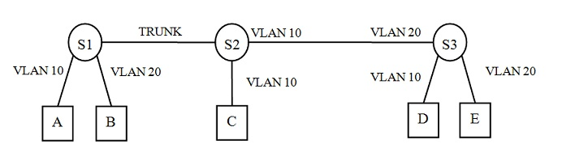

# 计算机网络理论练习题 - 作业 3

作业名称：作业3

作业描述：以太网，透明网桥，生成树，VLAN

截止时间：2019/4/7 23:00:00

总题数：26

## 习题及答案

1. CSMA属于以下哪种类型的协议？

   A.Random Access Protocol

   B.Take Turns Protocol

   C.Centralized Protocol

   D.Preemptive Protocol

   Answer:
   A

2. 以下哪个子层定义了主机何时以及如何访问共享介质？

   A.MAC

   B.LLC

   Answer:
   A

3. 以下哪个LLC协议提供面向连接的服务?

   A.LLC1

   B.LLC2

   C.LLC3

   Answer:
   B

4. 上网查询三种CSMA协议：non-persistent CSMA;p-persistent CSMA;1-persistent CSMA，并根据下面描述确定是哪个CSMA？

   (1)如果信道忙时有两个站点想发送数据，则它们一定会冲突。

   (2)在信道较忙时最省电。

   Answer:
   1-persistent CSMA, non-persistent CSMA

5. CSMA/CD使用了以下哪种CSMA协议?

   A.non-persistent CSMA

   B.p-persistent CSMA

   C.1-persistent CSMA

   Answer:
   C

6. 以太网采用了什么成帧(framing)方法?

   A.character-stuffing

   B.physical layer coding violation

   C.byte-counting

   D.inter-frame space

   Answer:
   D

   Explanation:
   每帧发送前要求信道空闲时间至少为96bits，这会造成每帧之间有空隙。

7. 由集线器(hub)连接形成的以太网是以什么方式工作的？

   A.full duplex

   B.half duplex

   C.simplex

   Answer:
   B

   Explanation:
   集线器采用电子线路方法模拟总线方式的以太网，两台主机同时发送会产生冲突。

8. 当一个以太网的信道忙时有五个站点都想发送一个最长帧(长度为1520B)，如果很长时间只有这五帧要发送，问最少经过几次冲突就可以全部发送成功？※

   Answer:
   4

   Explanation:
   最长帧大概占用20个以上的时间槽，所以在第1、2、3、4次冲突的延迟时间最多16个时间槽，首先发送的站点都会引起后续所有站点冲突。每次冲突后都让一个站点发送成功，所以最少4次冲突。

9. 下面的以太网有多少个冲突域？有多少个广播域？

   

   Answer:
   8,1

   Explanation:
   交换机的每个端口处于一个冲突域，集线器的所有端口处于一个冲突域。

10. 描述以太网的CSMA/CD协议，请填空：(1)发送前先（    ），如果信道忙，则（    ），直到信道空闲（    ）;(2)（    ）边检测冲突;如果直到发送完毕都没有检测到冲突，则（    ）;一旦检测到冲突，立即（    ）,在（    ）一段时间之后，转(1)。

    可选词汇：随机延迟 发送成功 立即发送 持续监听 停止发送 边发送 监听信道 

    Answer:
    监听信道，持续监听，立即发送，边发送，发送成功，停止发送，随机延迟

11. 如果把以太网协议修改为：在一个站点发送之后另一个站点发送时要求的帧间空隙为w1， 一个站点在自己发完一帧之后再接着发送另一帧时要求的帧间空隙为w2，以下哪些陈述是正确的?

    A. 如果w1 > w2, 一个有多帧要发送的站点一旦开始发送将连续发送多帧。

    B. 如果w1 > w2, 如果有其它站点要发送，当前站点发送完毕后即让出信道。

    C. 如果w1 < w2, 每次所有站点（包括刚发送完的站点）都平等争用信道。

    D. 如果w1 < w2, 如果有其它站点要发送，当前站点发送完毕后即让出信道。

    E. 如果w1 = w2, 每次所有站点（包括刚发送完的站点）都平等争用信道。

    Answer:
    A，D，E

12. 对于以太网，以下说法是否正确,标出正确的说法：

    A.一个站点有可能一直不能发送成功

    B.优先权高的站点先发送数据帧

    C.收到数据帧的站点会发送确认帧

    D.如果很长时间信道空闲，一个站点发送数据帧时一定不会冲突

    E.规定最短帧是为了使发送站点可以检测到所有冲突

    F.属于同一个以太网的所有站点都可以收到广播帧

    Answer:
    A，E，F

13. 以太网(10BaseT)、快速以太网(100Base-TX)和千兆以太网主要在OSI的哪层或哪个子层不同？ 

    A.物理层

    B.数据链路层

    C.网络层

    D.MAC子层

    E.LLC子层

    Answer:
    A

14. 以下哪个操作不是透明网桥算法的操作？

    A.filtering

    B.forwarding

    C.flooding

    D.blocking

    Answer:
    D

15. 下面的扩展LAN包含三个透明网桥B1、B2、B3和四台主机A、 C、D、E。如果网桥的MAC地址表初始都是空的，在以下三次传输之后MAC地址表的内容是什么？

    (1) D发送了一个帧给E;

    (2) A发送了一个帧给D;

    (3) C发送了一个帧给A.

    

    Answer:

    B1的MAC地址表：

    | MAC地址 | 接口 |
    | ------- | ---- |
    | D       | 1    |
    | C       | 2    |
    |         |      |

    B2的MAC地址表：

    | MAC地址 | 接口 |
    | ------- | ---- |
    | D       | 3    |
    | A       | 1    |
    | C       | 2    |

    B3的MAC地址表：

    | MAC地址 | 接口 |
    | ------- | ---- |
    | D       | 1    |
    |         |      |
    |         |      |

16. 以太网集线器(hub)与交换机(switch)有何不同？※ 

    A.A switch does not induce any latency into the frame transfer time.

    B.A switch tracks MAC addresses of directly-connected devices.

    C.A switch operates at a lower, more efficient layer of the OSI model.

    D.A switch decreases the number of broadcast domains.

    E.A switch decreases the number of collision domains

    Answer:
    B

    Explanation:
    交换机会增加冲突域的数量，减少冲突范围的大小

17. 以下哪个设备只属于物理层?

    A.Switch 

    B.hub

    C.router

    D.Bridge

    Answer:
    B

18. 如果主机A发送IP分组给主机B, 主机B收到的帧中的源地址是什么? 

    连接模式: [host A]--[Router R1]--[Router R2]--[host B]，其中包含3个以太网。

    A.host A''s MAC Address

    B.host B''s MAC Address

    C.R1''s MAC Address

    D.R2''s MAC Address

    Answer:
    D

19. 如果透明网桥从接口F0/23收到源地址和目的地址分别为S和D的帧，它将把以下哪个项目记录到MAC地址表?

    A.D, F0/23

    B.S, F0/23

    C.D, S

    D.S, D

    Answer:
    B

20. 下图显示了由五个透明网桥(B1~B5)形成的扩展LAN。

    

    如果网桥ID使用其下标，所有链路的开销均为1，问：

    (1) 哪个是根网桥? 

    (2) 网段A~D的指定网桥(designated bridges)分别是什么?

    A:（    ）B:（    ）C:（    ）D:（    ）

    (3) 网桥B1~B5的根端口分别是什么? 

    B1:（    ）B2:（    ）B3:（    ）B4:（    ）B5:（    ）

    Answer:
    （1）B1
    （2）B1 B1 B2 B4
    （3）无 1 1 2 2

21. 下图是一个扩展LAN:

    

    请回答问题：

    (a)如果B1没有启动生成树算法但是转发生成树消息(BPDU)，生成树的个数是多少？ 它们的根分别是什么？ 

    (b)如果B1没有启动生成树算法而且丢弃所有收到的生成树消息(BPDU)，生成树的个数是多少？ 根分别是什么？ 

    Answer:
    (a)1  B2
    (b)2  B2,B4

    Explanation:

    (a)B1连接的网段(DEFGH)和B1一起会形成一个网段

    (b)B2、B3、B5、B7 一棵树；B4、B6 一棵树

22. 证明透明网桥算法自学习方法的合理性.

    Answer:

    （1）网桥从一个接口收到一个帧，该帧中源地址的主机一定与该接口连通

    （2）如果整个扩展LAN没有回路，则该接口处于从该网桥到达该主机唯一的路径上。该网桥只有必须把目的地址为该源地址的帧转发到该接口该帧才有可能到达目的地。

23. 对于一个连通图，每条边的权重都不为0。任意指定一个节点为根节点,如果每个节点从且仅从一条到根节点的最短路径上选择它的邻接边,证明这些边将形成该图的生成树。

    Answer:

    方法1：N个节点总共有N-1条边，根据到根节点的距离用归纳法证明连通性：按到根的距离把节点排序，一个节点的最短路径上的下一个节点与根连通，则该节点也会与根连通。具有N-1条边和N个节点的连通图是生成树。

    方法2：假设N-1个节点通过这种方法加入N-1边都不形成回路，则再加入一个节点和一条与之相连的边也不会形成回路,因为由此形成的回路肯定要经过这个节点，这个节点至少要增加两条边，这与前面的操作矛盾。具有N-1条边的没有回路的N个节点的图就是生成树。不过还要证明：如果它们不连通，则会形成n棵树 (n>1)，则这些树的边数（Ni-1，Ni为第i棵树的节点数）之和为N-n，小于N-1，因此，它们必须连通。

24. 为什么二进制指数退避算法选择最短帧的发送时间作为其时间槽(time slot)τ的长度?

    Answer:
    因为最短帧的发送时间保证了首先发送的站点的信号可以到达最远的站点。如果先发送的只有一个站点，其他站点要不就检测到发送站点的信号而不能发送，要不就因为发送站点发送完毕而检测到信道空闲，总之不会与之冲突。也就是说，任何间隔τ或以上时间的两个发送数据的站点不会发生冲突。

25. 如果所有交换机都是连通的，并且交换机连至交换机的接口都配置为trunk接口，交换机连至主机的接口都配置为VLAN接口（主机接口），则所有连至相同的VLAN接口的主机都位于同一个广播域，连至不同VLAN接口的主机位于不同的广播域。这句话是否正确？

    A.正确

    B.错误

    Answer:
    A

26. 下图中哪些发送的帧将被目的主机收到？

    

    E发送给A.

    E发送给B.

    A发送给E.

    A发送给D. 

    B发送给D.

    D发送给A.

    D发送给B.

    Answer:
    E发送给A, A发送给E
