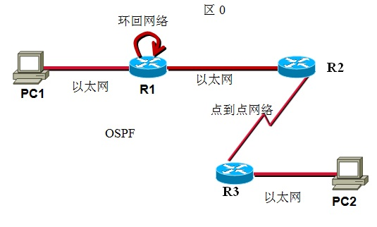
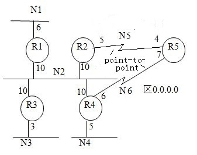

# 计算机网络理论练习题 - 作业 5

作业名称：作业5

作业描述：Routing Protocols: RIP, OSPF

截止时间：2019/5/28 23:00:00

总题数：19


## 习题及答案

1.  什么是自治系统(Autonomous System)? 

    A. a kind of automobile system  
    B. a kind of organization  
    C. a kind of web server  
    D. a kind of computer system  
    E. a kind of network

    <details><summary>Answer</summary>
        E
    </details>

    

2.  以下哪个协议是外部网关协议(Exterior Gateway Protocol)?

    A.RIP  
    B.OSPF  
    C.BGP  
    D.EIGRP  

    <details><summary>Answer</summary>
        C
    </details>

    

3.  RIP协议采用了什么路由算法? 

    <details><summary>Answer</summary>
        距离向量路由算法
    </details>

    

4.  简述RIP协议的工作原理。 

    <details><summary>Answer</summary>
        路由器每30秒把自己的路由表发送给邻居。路由器用邻居发来的路由表根据最短路径算法修改自己的路由表。初始时每个路由器只有到直连网距离为1的路由。
    </details>

    

5.  路由器A~G运行RIP协议，每跳的距离为1。B和C是邻居。如果B和C此时的路由表如下所示：

    ```
    路由器B的路由表
    =========================
    目的网络     距离      下一跳     
    N1           5         A     
    N3           3         C     
    N6           2         E     
    N9           5         D     
    N10          1         -
    =========================
    
    路由器C的路由表
    =========================
    目的网络     距离      下一跳
    N1           3         F     
    N3           6         F     
    N6           3         B     
    N7           3         G     
    N9           5         G     
    N10          2         B
    =========================
    ```

    当路由器B接收到来自C的路由表之后对路由表进行自己的更新， 请写出更新之后B的路由表(注意：网络下标从小到大):

    <details><summary>Answer</summary>
    <pre>
    Answer:
    N1   4   C
    N3   7   C
    N6   2   E
    N7   4   C
    N9   5   D
    N10  1   -
    &nbsp;
    Explanation:
    N3以前是从Router C学来的，只要C送来的路由表包含该项，就必须修改。
    </pre>
    </details>

    

6.  如果路由器B离路由器A的距离是10跳: Router A--10 hops--Router B。当一个网络接入路由器A，路由器B要建立该网络的路由最长需要多少秒？

    <details><summary>Answer</summary>
        300或330<br />
        Explanation:
        题目有些模糊，如果说距离是10，答案就是300，距离是10跳指10个路由器，答案就是330，所以两种答案都算对。
    </details>

    

7.  两个RIP路由器连接了三个网络: N1--R1--N2--R2--N3。在R1因N1失效而把N1的路由的距离改为16（无穷大）之后，下面哪个事件会触发计数到无穷现象？

    A. R1 sends its routing table to R2.  
    B. R2 sends its routing table to R1.  
    C. N2 fails.  
    D. N3 fails.

    <details><summary>Answer</summary>
        B
    </details>

    

8.  水平分割(Horizon-split)算法可以防止任何计数到无穷的现象，true or false? 

    A.true  
    B.false

    <details><summary>Answer</summary>
        B
    </details>

    

9.  OSPF协议采用了什么路由算法? 

    <details><summary>Answer</summary>
        链路状态路由算法
    </details>

    

10.  简述OSPF协议的工作原理。 

     <details><summary>Answer</summary>
         把网络转变为图，然后利用最短路径算法得到路由表：<br />
         (1) 路由器周期性地收集(形成)链路状态，并扩散给AS 中的所有路由器; (2) 路由器用收到的链路状态建立整个AS的拓扑结构图; <br />
         (3) 利用Dijkstra算法计算到AS中所有网络的最短路径; <br />
         (4) 利用这些路径上的下一跳建立路由表。 
     </details>

     

11.  下图中的路由器R1、R2和R3运行OSPF协议，问：

     

     有多少个router LSA?  
     有多少个network LSA?

     <details><summary>Answer</summary>
         Answer:
         3  1<br />
         Explanation:
         环回网络只是末端网。只有一个中转的多路访问网络，所以netwrok LSA的个数为1.
     </details>

     

12.  一个OSPF路由器通常使用什么算法来求到所有目的地的最短路径? 

    <details><summary>Answer</summary>
        Dijkstra算法
    </details>

    

13.  如果一个OSPF路由器的链路没有变化，它每隔多长时间会扩散它的LSA？ 

     A.60分钟  
     B.30分钟  
     C.30秒  
     D.60秒

    <details><summary>Answer</summary>
        B
    </details>

    

14.  一个OSPF路由器如何知道它的一个直连网是中转网？

    <details><summary>Answer</summary>
        这个网为多路访问网络且在这个网络中有OSPF邻居（建立了完全相邻关系）
    </details>

    

15.  下图的OSPF网络中，R1~R5的router LSA是什么？

     

     链路类型取值：  
     1 Point-to-point network  
     2 Link to transit network  
     3 Link to stub network

     从R1:

     | 到   | 开销 | 链路类型 |
     | ---- | ---- | -------- |
     |      |      |          |

     从R2:

     | 到   | 开销 | 链路类型 |
     | ---- | ---- | -------- |
     |      |      |          |

     从R3:

     | 到   | 开销 | 链路类型 |
     | ---- | ---- | -------- |
     |      |      |          |

     从R4:

     | 到   | 开销 | 链路类型 |
     | ---- | ---- | -------- |
     |      |      |          |

     从R5:

     | 到   | 开销 | 链路类型 |
     | ---- | ---- | -------- |
     |      |      |          |

     <details><summary>Answer</summary>
     <pre>
     Answer:
     From R1
     =======================
     to   metric   link type
     N1     6         3
     N2     10        2
     &nbsp;
     From R2
     =======================
     to   metric   link type
     R5    5         1
     N5    5         3
     N2    10        2
     &nbsp;
     From R3
     =======================
     to   metric   link type
     N2    10        2
     N3     3        3
     &nbsp;
     From R4
     =======================
     to   metric   link type
     R5     6         1
     N6     6         3
     N2     10        2
     N4     5         3
     &nbsp;
     From R5
     =======================
     to   metric   link type
     R2     4         1
     N5     4         3
     R4     7         1
     N6     7         3
     &nbsp;
     Explanation:
     这里假设点到点网络都配置了IP地址,需要加上一个末端网的节点，具体的看课件。
     </pre>
     </details>

     

16.  在上题图中，N2的Network LSA是什么？
     从N2:

     | 到   | 开销 |
     | ---- | ---- |
     |      |      |

    <details><summary>Answer</summary>
    <pre>
    from N2
==================
    to  metric
R1  0
     R2  0
     R3  0
     R4  0
     </pre>
     </details>
     
     
     
17.  在15题的OSPF网络中，R5的路由表是什么?

     | 目的 | 开销 | 下一跳 |
     | ---- | ---- | ------ |
     |      |      |        |

     <details><summary>Answer</summary>
     <pre>
     N1  20   R2
     N2  14   R2
     N3  17   R2
     N4  12   R4
     N5  4     -
     N6  7     -
     </pre>
     </details>

     

18.  （RIP协议）无论回路有多长，只要所有路由器都启动了抑制算法，就不会出现计数到无穷的问题，请证明一下。

     <details><summary>Answer</summary>
     <pre>
         原答案：
         不会出现技术到无穷的现象。假设某个路由器中的某个直连网失效，该网络的路由的距离会变为无穷大，该路由会扩散出去，而且距离只会越来越远。
         ----
         上面的答案是错误的，在最远点的路由器R的这个距离无穷大的路由可能被其它邻居路由器发来的路由（距离&lt;16）所修改，因为邻居路由器不是路由器R的这个路由的下一跳。
     </pre>
     </details>

     

19.  在路由有变化时，立即将有变化的路由发送给邻居，这就是RIP的触发更新机制。试着解释一下为什么有了触发更新还要保留原有的每30秒把路由表发送给邻居的机制。

    <details><summary>Answer</summary>
        触发更新可能丢失；路由表也可能出错；要用TTL清除无效路由。可以考虑一个特例：当一个网络由于一条线路出故障变为了两个网络，这时用触发更新很难清除无效路由。
    </details>
