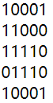

# 计算机网络理论练习题 - 作业 2

作业名称：作业2

作业描述：数据链路层

截止时间：2019/3/24 23:00:00

总题数：24


## 习题及答案

1. 数据链路层的功能是负责在（    ）中传输数据帧。

   Answer:
   物理网络

2. 以下哪些是数据链路层的功能?

   A.framing

   B.error detection

   C.error control

   D.routing

   E.medium access control

   F.encryption

   Answer:
   ABCE

3. 以下为收到的带有二维奇偶校验码(偶校验)的数据:

   

   请问哪个位置的比特出错了？

   A.row 1 col 2

   B.row 5 col 4

   C.row 4 col 3

   D.row 4 col 2

   Answer:
   D

4. 二维奇偶校验码是否可以检出所有的两位错误？

   A.可以
   B.不可以

   请证明你的结论。

   Answer:
   A

   Explanation:
   如果这两位错在同一行，则会有两列发现错误，如果不在同一行，则会有两行发现错误。

   My idea：

   可以。
   假设二维奇偶校验用于的数据序列可以划分为m*n的矩阵，m>=2，n>=2。所有的两位错误可以分为如下三类进行讨论：
   1. 两位错误位于同一行。此时，所有的行校验码不变；而发生错误的两位所在的列将校验失败，因此可以检测出（但不能纠正）。
   2. 两位错误位于同一列。此时，所有的列校验码不变；而发生错误的两位所在的行将校验失败，因此也可以检测出（但不能纠正）；
   3. 两位错误既不在同一行，也不在同一列。对于任一错误的位，其所在的行和列都将校验失败，因此不但可以检测出错误，还可以纠正这种错误。

   综上所述，二维奇偶校验码可以检出所有的两位错误。

5. 根据下面给出的二维奇偶校验码证明二维奇偶校验码不能纠正两位错误。

   

   Answer:
   任何一行两位出错，都只能发现哪两列有错，但是不能确定它们在哪一行。

6. 数据(十六进制)8AE4B578E0E6EE03的检验和是什么? 

   Answer:
   F0B7

   Explanation:
   按16位加起来，进位加到结果中去。

7. 数据为110101101100011011(D)，除数(G)为10011, CRC校验码(R)是什么？(二进制) ※

   Answer:
   1000

   Explanation:

   ```
   1101011011000110110000   （后面加的0的个数比除数位数少1）
   10011
    10011
    10011
         10110
         10011
           10100
           10011
             11111
             10011
              11000
              10011
               10111
               10011
                 10010
                 10011
                     1000
   ```

   

8. 如果当前RTT=1ms，采用选择性重传(selective repeat)滑动窗口协议，超时时间应设置为略大于（    ）ms；如果收到NAK就重置所有的超时定时器，那超时时间应设置为略大于（    ）ms。

   Answer:
   2，1

   Explanation:
   这里假设收到NAK的重传不重置超时定时器，否则，一个RTT也可以。

9. 如果滑动窗口协议的发送窗口大小为42，当前有20帧发送出去了但未收到确认, 问有新的确认帧到达前还可以发送多少帧? 

   Answer:
   22

10. 把停等协议用于一个带宽为20Mbps、长度为3000公里、传播速度为200000公里/秒的点到点链路，如果最长帧为5000字节，带宽的最大利用率(最大吞吐量/带宽)是百分之多少? 

    Answer:
    6.25

    Explanation:
    最大吞吐量：`5000*8/(5000*8/20M+2*3000/200000)=40000/(2ms+30ms)=1.25Mbps`

    1.25/20=6.25%

11. 如果上题改为滑动窗口协议，发送窗口大小为8，带宽的最大利用率(最大吞吐量/带宽)又是百分之多少?※

    Answer:
    50

    Explanation:
    最大吞吐量：`5000*8*8/(5000*8/20M+2*3000/200000)=320000/(2ms+30ms)=10Mbps`

    10/20=50%

12. 如果使用回退N滑动窗口协议，发送窗口大小为4，可以循环使用的序号为0~7，RTT大于4帧的发送时间。如果发送方发送了从序号3开始的10个数据帧，除了第2帧（序号为4）和第5帧（序号为7）丢失，包含重传帧在内的其它帧均正确到达接收方，问接收方依次收到这些帧（含重传帧）的序号（序号之间用一个空格隔开）。

    Answer:
    3 5 6 4 5 6 7 0 1 2 3 4

13. 如果上题改为选择性重传，并且接收窗口大小等于发送窗口大小，并且只有第2帧丢失，问接收方依次收到这些帧（含重传帧）的序号（序号之间用一个空格隔开）。

    Answer:
    3 5 6 7 4 0 1 2 3 4

14. PPP协议用以下哪个协议获取IP地址？

    A.LCP

    B.IPCP

    C.IPXCP

    D.CHAP

    Answer:
    B

    Explanation:
    IPCP用于IP协议，IPXCP用于IPX协议。IP地址是IP协议的

15. PPP协议用以下哪个协议确定是否需要身份认证？

    A.LCP

    B.IPCP

    C.IPXCP

    D.CHAP

    Answer:
    A

    Explanation:
    LCP用于确定链路层的参数和是否要身份认证等

16. 停等协议至少需要多少个序号？为什么？※

    Answer:
    2个。

    Explanation:
    正常情况是不需要序号的。出错的情况有三种：（1）数据帧丢失（2）确认帧丢失（3）确认帧在超时时间之后返回。如果没有序号，（2）（3）会出现重复接收，（3）还会出现错误确认。用2个序号就可以防止这些错误出现。

    My idea:

    如果只有一个序号（相当于不使用序号），则会引起歧义。考虑“超时”情况：首先发送方发送了一帧，一段时间后定时器超时，将重传该帧，重传后第一帧的确认帧才到来，然后发送方将会发送第二帧，接着重传第一帧的确认帧到来——如果没有序号，则发送方不能区分最后这个确认帧究竟是重传第一帧的确认帧，还是发送第二帧的确认帧。因此，至少需要2个序号。

17. 选择性重传协议的RWS大于SWS是否有意义？为什么？

    Answer:
    没意义，错序到达的帧加上期待接收的帧最多SWS个。

    Explanation:
    另一种说法：发送方发送的未确认的帧最多只有SWS个，接收方只需要缓存这些帧，故RWS没有必要大于SWS。

    My idea:

    没有意义。
    选择性重传协议之所以存在RWS，是为了缓存乱序到达的帧。发送窗口由“已发送未确认”和“未发送但可以发送”的帧组成，大小为SWS，一种极限情况是，发送窗口中的所有帧全部都已经发送出去，而发送窗口内的第一帧（称它为帧A）未确认，后续的帧都得到了确认。这时，接收窗口最多需要缓存SWS-1个乱序到达的帧，因为接收窗口的第一个位置期待接收帧A而却未收到。
    经过以上分析容易知道，受到SWS的限制，接收窗口中有内容的帧的数量不会超过SWS，因此RWS没有必要大于SWS，否则是多余的。

18. 选择性重传协议需要的最少序号个数与SWS和RWS有什么关系？为什么？※

    Answer:
    序号个数>=SWS+RWS。如果接收方收到新的SWS个帧，发回的确认全部丢失，在这种情况下，序号少了就会出现重复错误。（只批改了第一问）

    My idea:

    需要的最小序号个数是SWS+RWS。因为如果序号个数小于SWS+RWS，一种极限情况是发送窗口内发送的数据的确认帧全部丢失，此时接收窗口已经向后移动；由于序号数量不够，会出现重复错误——发送方再次重发这些帧时，会导致接收方误认为这是新到来的数据帧。
    综上，序号个数必须大于或等于SWS+RWS。

19. 选择性重传协议可能会收到落在接收窗口之外的数据帧。这句话是否正确？请解释。

    Answer:
    正确。因确认帧丢失或超时到达而重传的数据帧都会落在接收窗口之外。

    My idea:

    正确。
    考虑“确认帧丢失”这一情况。对于接收方，它已经发送了确认帧，因而接收窗口向后移动。对于发送方，由于确认帧的丢失触发了重传机制，它将重新发送该帧。因此接收方就收到了接收窗口之外的帧。

20. 回退N协议可能会收到落在发送窗口之外的确认帧。这句话是否正确？请解释。

    Answer:
    正确。如果因确认帧迟到而出现超时重传，就可能收到一个帧的两个确认帧。第二个确认帧就会落在发送窗口之外。

    My idea:

    正确。
    考虑“超时”情况。对于发送方，它发送了数据帧（称为A），但是直到超时都没收到确认，因此它将重传数据帧（称为B），此后，帧A的确认帧到来（超时到达），发送窗口将会向后移动。窗口移动后才收到B的确认帧，这就是落在发送窗口之外的确认帧。

21. 选择性重传协议丢失了NAK并非致命错误。这句话是否正确？请解释。

    Answer:
    正确，因为还有超时重传机制确保可靠性。
    多个帧丢失后的一种NAK发送机制：发送NAK时启动一个超时定时器，在其到期之前不会再发送NAK，而是发送ACK。

    My idea:

    正确。
    因为若丢失了NAK，则发送方既不会收到相关数据帧的ACK，也不会收到它的NAK，那么发送方关于这一帧的超时定时器便会超时，然后发送方将重传这一帧。数据传输的可靠性依然可以得到保证。

22. 如果选择性重传协议不采用NAK，设计一种可行方法完成只重传丢失帧的任务。

    Answer:
    如果对一个帧收到了3个重复的确认帧之后重传该帧。（思考题，无标准答案）

    My idea:

    接收方在收到每个数据帧后，都向发送方发回相应编号的ACK。若乱序到达，不需做任何操作。发送方在定时器超时后，会重传没有收到ACK的数据帧。这样就实现了只重传丢失帧。

23. 为什么ARQ协议的超时时间不应设置得太长？

    Answer:
    如果超时时间设置得太长又经常出错，每次通过超时重传来纠正数据传送错误需要的时间也会很长，会大大降低线路的吞吐量。（思考题）

    My idea:

    若超时时间设置得太长，则可能不能及时地发现丢包现象并尽快重发，从而浪费时间进行不必要的等待，降低了链路的吞吐量和效率。

24. 滑动窗口协议的确认帧的确认号表示什么含义，它这样表示的好处是什么？※

    Answer:
    表示该帧以及之前的帧均已被接收方收到。通过延迟确认，可以少发送确认帧。如果前面的确认帧丢失，后面到达的确认帧也可以对前面帧的确认，提高了可靠性。（思考题）

    My idea:

    确认号表示该序号及其以前序号的数据帧都已收到。好处是使用了累积确认，不需要每一帧单独确认，减小了链路的传输压力，提高了吞吐量和可靠性。