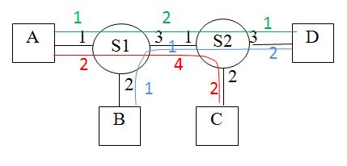
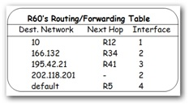
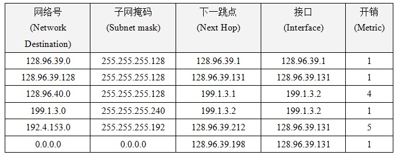
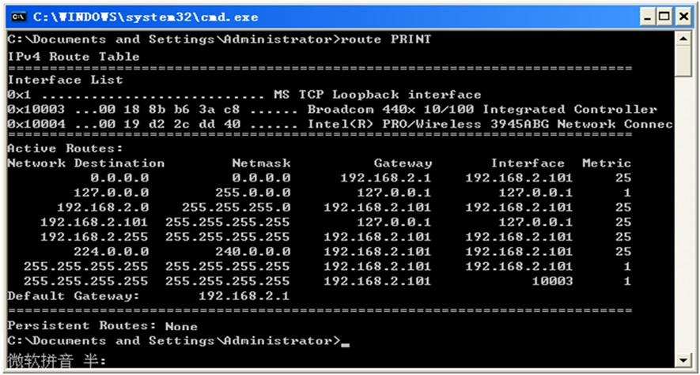

# 计算机网络理论练习题 - 作业 4

作业名称：作业4

作业描述：IP协议和IP地址

截止时间：2019/5/7 23:00:00

总题数：39

## 习题及答案

1.  电话系统采用的服务模型与哪种ATM服务模型类似?

    A.恒定位速率

    B.可变位速率

    C.可用位速率

    D.未指定位速率

    

Answer

        A
    

    

2.  以下哪种交换技术采用包交换技术且在传送数据之前需要建立连接？

    A.电路交换

    B.数据报

    C.永久虚电路

    D.交换式虚电路

    

Answer

        D
    

3.  下图存在3条虚电路（red,green,blue） ，它们都是从A或者B出发的虚电路，请填写它们的虚电路表(虚电路填写次序: red,green,blue)。

    * 接口编号用黑色字表示. VCI - Virtual Circuits Identifier

    

    交换机S1的虚电路表

    \------------

    输入接口                      输入VCI                   输出接口                      输出VCI

    

    交换机S2的虚电路表

    \------------

    输入接口                      输入VCI                   输出接口                      输出VCI  

    

Answer

    <pre>
    Answer:
    S1
    ========
    1 2 3 4
    1 1 3 2
    2 1 3 1
    &nbsp;
    S2
    ========
    1 4 2 2
    1 2 3 1
    1 1 3 2
    </pre>
    

4.  IP协议可以提供哪种服务?

    A.constant bit rate service

    B.connection-oriented service

    C.reliable transmission service

    D.guaranteed rate service

    E.best effort service

    

Answer

        E
    

5.  下面哪些关于IP协议的说法是正确的？

    A.IP协议是因特网的网络层协议.

    B.IP协议可以提供可靠服务.

    C.IP协议可以提供一种数据报服务.

    D.IP协议是可路由的(routable).

    E.IP协议可以用于连接任何物理网络.

    F.IP协议具有拥塞控制机制.

    

Answer

        A,C,D,E
    

6.  现在使用IP数据报的服务类型字段提供不同的服务被重新定义为（    ）。

    

Answer

        区分服务
    

7.  下面哪些关于IP数据报的TTL字段的说法是正确的？

    A.每经过一个路由器TTL减1.

    B.TTL的最大值为128.

    C.TTL是数据报经过的跳数.

    D.TTL限制了因特网的直径.

    E.TTL记录数据报在网上存在的时间.

    F.TTL防止数据报长时间滞留在因特网上.

    

Answer

        A,D,F
    

8.  IP数据报头部选项最长可以是多少字节？

    

Answer

        40
    

9.  如果一个IP数据报的协议字段的值为17, 目的主机应该把该数据报交给哪个上层协议?

    A.TCP

    B.UDP

    C.ICMP

    D.IGMP

    

Answer

        B
    

10.  如果不带选项的IP数据报被分段, 这些片段头部的哪些字段可能与原数据报头部字段的内容不一样?

    A.header checksum

    B.MF

    C.offset

    D.TTL

    E.total length

    F.Identification

    G.destination address

    H.protocol

    

Answer

        ABCE
    

11.  一个没有选项的IP数据报的总长度为3000字节，标识(iden)是10034，DF=0，OFFSET=0，要转发到MTU为800的一个物理网络上。如果前面的片段尽量大，如何划分片段？填写这些片段的 iden、offset、MF。 ※
     片段1：（    ）（    ）（    ）,
     片段2：（    ）（    ）（    ）,
     片段3：（    ）（    ）（    ）,
     片段4：（    ）（    ）（    ）。

    

Answer

    <pre>
    10034 0   1
    10034 97  1
    10034 194 1
    10034 291 0
    </pre>
    

    
12.  如果上题的第二个片段在后面的一个路由器上要转发到MTU=300的物理网络上，要继续划分片段，填写这些片段的 iden、offset、MF。 ※
     片段1：（    ）（    ）（    ）,
     片段2：（    ）（    ）（    ）,
     片段3：（    ）（    ）（    ）。

    

Answer

    <pre>
    10034  97  1
    10034  132 1
    10034  167 1
    </pre>
    

    
13.  IP的记录路由选项中如果指针为16，表示记录了多少个IP地址？

    

Answer

        3
         
        Explanation:
    	指针为4时0个，为8时1个,为12时2个,为16时3个
    

    
14.  下面哪些关于两个IP地址的说法是正确的?

     A.如果它们在不同的网络，则它们的网络号必须不同.

     B.如果它们在不同的网络，则它们的主机号必须不同.

     C.如果它们在相同的网络，则它们的主机号必须相同.

     D.如果它们在相同的网络，则它们的网络号必须相同.

     E.如果它们在相同的网络，则它们的主机号必须不同.

    

Answer

        ADE
    

15.  下面的IP地址中A类、B类、C类地址分别有几个? （    ）（    ）（    ）

     *   92.168.1.100
     *   129.32.123.54
     *   223.89.201.145
     *   220.18.255.254
     *   124.254.200.254
     *   191.64.220.8
     *   66.254.1.100
     *   192.1.100.1
     *   202.15.200.12

    

Answer

        3 2 4
    

16.  关于IP分组和IP地址的填空:

     A.把IP多播地址224.0.1.5转换为MAC多播地址是什么？

     B.IP地址192.168.1.255是做什么的？

     C.点分十进制IP地址以127开头的是什么地址？

     D.如果数据部分为IP分组，以太网的类型字段的值是什么？ ※

     E.有类地址191.168.1.2的网络号和主机号分别是什么？

     F.一个C类网可用的IP地址有多少个？

    

Answer

        A. 01-00-5E-00-01-05 
        B. 对远程子网的广播 
        C. 环回地址 
        D. 0x0800 
        E. 191.168  1.2 
        F. 254
    

    
17.  一个C类网192.1.2.0划分为6个子网，它们分别需要配置2、2、2、2、50、50个接口的IP地址。如果要求消耗最少的IP地址,请采用点分十进制(dotted decimal)格式(a.b.c.d)写出它们的子网号和子网掩码（地址从小到大）： 

    

Answer

    <pre>
        192.1.2.0  255.255.255.252
        192.1.2.4  255.255.255.252
        192.1.2.8  255.255.255.252
        192.1.2.12 255.255.255.252
        192.1.2.64 255.255.255.192
    	192.1.2.128 255.255.255.192
    </pre>
    

    
18.  如果用8个C类网193.10.24.0~193.10.31.0形成一个超网(supernet),该超网的子网号和子网掩码是什么？

     *   子网号和子网掩码都用点分四进制表示a.b.c.d

    

Answer

        193.10.24.0 255.255.248.0
    

19.  下面哪些地址为私有地址? 

     A.10.200.10.1

     B.192.1.1.5

     C.172.15.1.10

     D.172.32.1.1

     E.192.168.254.1

     F.192.169.1.1

     G.172.31.200.254

     H.192.168.255.254

    

Answer

        AEGH
    

20.  采用NAT技术，如果从外网发回的IP分组中应该转换的IP地址和端口号是哪个？

     A.源IP地址和源端口号

     B.目的IP地址和目的端口号

     C.源IP地址和目的端口号

     D.目的IP地址和源端口号

    

Answer

        B
    

21.  ARP请求包的字段哪些是已知的?

     A.source IP address

     B.source MAC address

     C.source port number

     D.dest IP address

     E.dest MAC address

     F.dest port number

    

Answer

        ABD
    

22.  关于ARP协议,下面哪些说法是正确的?

     A.一台主机可以通过ARP协议通过远端IP地址(非直连网)取得其对应的MAC地址。

     B.在收到ARP请求后源主机的IP地址和MAC地址的映射会缓存在目的主机中。

     C.一个ARP请求可以同时包括多个IP地址。

     D.ARP请求会超时重传。

     E.任何物理网络都要使用ARP协议获得MAC地址。

     F.缓存的IP地址和MAC地址的映射具有生存期。

    

Answer

        BF
    

23.  在一个以太网中，哪个DHCP数据包可以让该网络中的每个DHCP服务器知道DHCP客户端是否选用了它提供的IP地址?

     A.DHCP discover

     B.DHCP offer

     C.DHCP request

     D.DHCP ack

    

Answer

        C
    

24.  转发IP分组时，在下面哪些情况下，路由器会发送ICMP数据报通知源主机?

     A.IP数据报的TTL在路由器上减到0.

     B.对IP数据报进行了分段.

     C.用目的地址没有查到匹配的路由项.

     D.目的地址只匹配了默认路由.

     E.头部检验出错.

     F.IP分组头部有选项.

    

Answer

        ACE
    

25.  填写上题中发送的ICMP数据报的类型和代码。

    

Answer

        A：类型11，代码0； 
        C：类型3，代码1； 
    E：类型12，代码0。
    

    
26.  填空：

     （1）RIP协议属于（    ）

     （2）OSPF协议属于 （    ）

     （3）BGP协议属于（    ）

     （4）路由表中手工配置的路由项称为（    ）

     （5）采用路由协议自动得到的路由称为（    ）

     （6）直连网的路由和默认路由都属于（    ）

     （7）路由协议所用的算法称为（    ）算法。

     可选项：路由，动态路由，静态路由，IGP协议，EGP协议

    

Answer

        Answer:
        IGP协议，IGP协议，EGP协议，静态路由，动态路由，静态路由，路由
     
        Explanation:
        默认路由也由IGP协议注入的动态路由。
    

    
27.  下面关于查询路由表和转发IP分组的说法哪些是正确的?

     A.路由表中每一行的下一跳和接口处于同一物理网络中。

     B.最长匹配原则意味着范围更大的网络首先被选中。

     C.IP分组总是被转发到下一跳。

     D.下一跳总是有IP地址。

     E.一个IP分组在转发之前总是要封装成帧。

     F.如果IP分组的目的地址就在路由器的直连的以太网，则需要用ARP通过该目的地址获得其对应的MAC地址。

     G.路由器会把目的地址为广播地址的IP分组从所有接口广播出去。

    

Answer

        AEF
    

28.  当路由器为一个IP分组查询路由表，对于以下几种情况，路由器会怎么做？从可选项中选择最合适的（填字母）

     (1)没有任何匹配项 

     (2)有匹配项，下一跳接口为以太网

     (3)有匹配项，下一跳接口为PPP

     (4)有匹配项，没有下一跳，匹配项的接口为以太网

     (5)有匹配项，没有下一跳，匹配项的接口为PPP

     可选项：

     A.用IP分组的目的地址查询MAC地址 (ARP协议)

     B.用下一跳的地址查询MAC地址 (ARP协议)

     C.直接把IP分组封装成帧发送出去

     D.用IP分组的源地址查询MAC地址 (ARP协议)

     E.直接把IP分组发送出去

     F.丢弃该分组

    

Answer

        FBCAC
    

29.  下图为路由器R60的路由表：

     

     如果R60依次收到目的地址为10.1.1.20、166.132.5.5、202.118.201.227、195.42.22.1的IP分组，R60转发它们的下一跳分别是什么？ 

    

Answer

    <pre>
    R12
    R34
    -
    R5
    </pre>
    

    
30.  下图为路由器R1的路由表：

     

     如果R1依次收到目的地址为192.4.153.17、128.96.39.10、128.96.40.12、128.96.40.151和192.4.153.90的IP分组，R1转发它们的下一跳分别是什么？ 

    

Answer

    <pre>
    128.96.39.212
128.96.39.1
    199.1.3.1
    128.96.39.198
    128.96.39.198
    </pre>
    

    
31.  主机和路由器通过三个以太网连接：[H1]-N1-[R1]-N2-[R2]-N3-[H2]。主机和路由器的每个接口的IP地址都配置正确。如果除了一种配置其他配置都是正确的，问其中哪种配置错误或者没有配置会导致一下问题？(填字母) 

     (1)H1可以ping通R1左边接口的IP地址但是ping不通R1右边接口的IP地址?（    ）

     (2)H1可以ping通R1右边接口的IP地址但是ping不通R2左边接口的IP地址?（    ）

     (3)H1可以ping通R2左边接口的IP地址但是ping不通R2右边接口的IP地址?（    ）

     (4)H1可以ping通R2右边接口的IP地址但是ping不通H2的IP地址?（    ）

     可选项：

     A.R1配置N3的静态路由指向R2

     B.R2配置N1的静态路由指向R1

     C.H1配置默认路由指向R1

     D.H2配置默认路由指向R2

    

Answer

        CBAD
    

32.  对于上题的三种情况，ping会分别返回什么错误？(填字母)

     A. timeout

     B. destination host unreachable

    

Answer

        BABA
    

33.  下面的路由表为一台主机的路由表，该主机有一个有线网卡(BroadCom)和一个无线网卡(Intel)，接口编号分别为0x10003和0x10004。无线接口为活动接口，其IP地址、子网掩码和默认网关分别为192.168.2.101、255.255.255.0、192.168.2.1。

     

     --下一跳(Gateway)：直连网(接口IP地址)或环回网络（127.0.0.1，即自己）。

     --接口(interface): 发往某个接口(接口IP地址)或环回接口(127.0.0.1)

     --最长匹配原则:多项匹配且子网掩码一样长时，选择metric最小的，

     如果metric也一样，则同时转发到这些网络。

     当要发送的IP数据报的目的地址分别匹配路由表的第1~8项时，其含义为？

     可选项：

     *   在无线网络中进行多播
     *   发给无线网络中的主机
     *   在有线网络中进行广播
     *   在无线网络中进行(远程)广播
     *   在无线网络中进行广播
     *   发给默认网关
     *   发给环回网络（自己）

    

Answer

        发给默认网关 
        发给环回网络（自己） 
    发给无线网络中的主机 
        发给环回网络（自己） 
        在无线网络中进行广播 
        在无线网络中进行多播 
        在无线网络中进行广播 
        在有线网络中进行广播
    

    
34.  用什么办法可以确定一个IP地址在一个以太网中没有(正在)被用?

    

Answer

    	用ARP协议去查询该IP地址(发送ARP请求)，没有响应该IP表示没有被用
    	 
        Explanation:
        ping可能被防火墙过滤掉，而ARP不会
    

    
35.  ping可以在子网中产生一个广播帧，请给出并解释方法。

    

Answer

        Answer:
        ping本网一个不存在的IP地址，因为ARP映射表中肯定没有，所以会发送ARP请求。ARP请求就是广播帧。或者直接ping对本网的广播，例如：ping 192.168.1.255。这个ICMP消息会用广播帧封装。
	 
        Explanation:
        ping非本网的IP地址，会匹配默认网关，而默认网关的MAC地址可能已缓存。
    

    
36.  一台路由器连接两个子网（以太网）: N1-[R1]-N2。如果一台主机从一个子网移到另一个子网，并修改为另一个子网的IP地址，如何增加路由器的功能使这台主机还可以接收到用原IP地址发给它的数据报？

    

Answer

        利用ARP协议，当其它主机在N1查询该主机的原IP地址的MAC地址时，R1要用自己的MAC地址进行响应。其它主机就会把IP数据报用帧发给R1，R1再转给该主机(位于N2中)。具体可查ARP代理
    

37.  用一个交换机连接主机H1和H2。H1如何可以窃听到本网络中任何发给H2的IP数据报?

    

Answer

        对任何用H2的IP地址查询H2的MAC地址的ARP请求，H1都要尽快用自己的MAC地址发出ARP响应。H1也可以用H2的IP地址和自己的MAC地址进行主动查询。
    

38.  如果一个路由器连接了两个以太网，如何采用DHCP协议让这两个以太网可以共用一个DHCP服务器？

    

Answer

        Answer:
    	这里假设DHCP服务器只能接入其中一个子网，并具有两个子网的地址池可分配，路由器作为DHCP中继代理： 
	当另一个子网的DHCP客户机广播请求地址租赁时，中继代理服务器就会把这个消息转发给另一子网中的DHCP 服务器，然后再将DHCP服务器返回的分配IP地址的消息转发给DHCP客户机，从而协助DHCP客户机完成地址租赁。 
    	DHCP服务器要根据DHCP中继代理给出的子网信息确定分配给客户机哪个子网的地址。
    

    
39.  当一台主机要向远方的另一台主机发送很多数据报。如果它希望这些数据报中途不要分段以节约路由器的时间，这就要找到路径上最小的MTU，有何方法？假设这段时间该路径不会改变。

    

Answer

        Ping远端主机，每个数据报的DF均设置为1（即不允许分段），ICMP有效载荷的字节数从大到小变化，直到得到响应。也可以直接发送数据报而不用ping。
    

40.  一台主机往远方的另一台主机发送数据报。如何可以通过数据报的TTL字段和ICMP协议依次（由近至远）得到整条路径上的路由器的IP地址（每个路由器只需要得到一个IP地址）? 假设这段时间该路径不会改变。

    

Answer

        不断ping另一台主机，并且TTL从1开始不断增加。查traceroute命令。
    

    