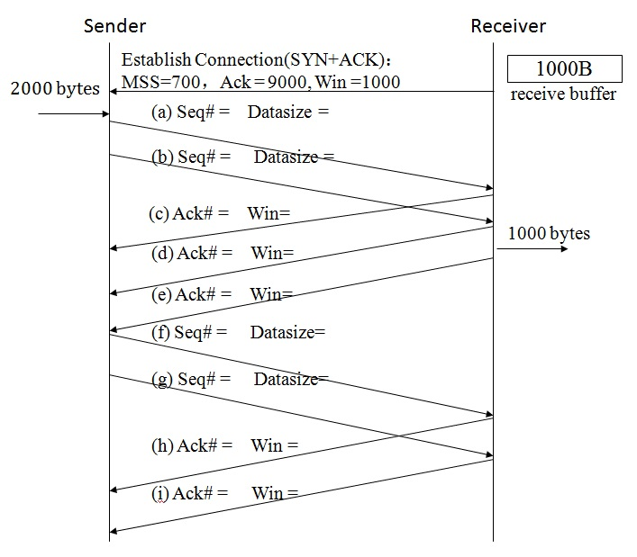

# 计算机网络理论练习题 - 作业 6

作业名称：作业6

作业描述：Transport Layer（传输层）

截止时间：2019/6/15 23:00:00

总题数：39

## 习题及答案

1.  因特网传输层的主要协议为（）和 （）

    

Answer

        UDP，TCP
    

2.  如果有效载荷为TCP，IP数据报的协议字段的值是什么?

    

Answer

        6
    

    

3.  以下哪些关于UDP协议的陈述是对的：

    A.它提供了面向连接(connect-oriented)的服务.

    B.传送的数据段会丢失.

    C.具有保序性.

    D.负责在进程之间传送数据.

    E.接收进程收到的数据段数与接收缓冲区大小有关.

    

Answer

        BD
    

    

4.  下面哪个部分被加入到UDP数据段的校验和中?

    A.UDP header(checksum filled with 0)

    B.UDP data

    C.Source IP address

    D.Dest IP address

    E.TTL(1B)and protocol(1B)

    F.Header CheckSum(2B)in IP Header

    G.0(1B)and protocol(1B) in IP Header

    H.Length(2B)in IP datatgram

    I.UDP Length(2B)

    J.Iden in IP datatgram(2B)

    K.flags(3b) and offset(13b) in IP datatgram

    

Answer

        A,B,C,D,G,I
    

    

5.  端口号1000是哪种类型的端口？
    A.well-known ports
    B.registered ports
    C.private ports

    

Answer

        A
    

    

6.  TCP的紧急数据(urgent data)是带外数据，不属于字节流，true or false?
    A.true
    B.false

    

Answer

        A
    

    

7.  数据段中哪个标志可以令TCP协议把缓存数据立即发给接收进程?
    
    A.ack
    
    B.rst

    C.psh
    
    D.fin

    

Answer

    C
    

    
    
    
8.  如果TCP连接出现错误，TCP协议将发送标志（）为1的数据段，并立即结束连接.

    

Answer

        RST
    

    

9.  以下哪个TCP会话是非对称的(asymmetric)?
    A.Establish connection
    B.Transfer Data
    C.Close Connection

    

Answer

        A
    

    

10.  对TCP连接而言，下面哪些叙述是正确的?

     A.TCP连接的一方接收的数据段数等于另一方发送的数据段数.

     B.一个进程可以与其它进程建立两个以上的TCP连接.

     C.一个TCP连接可以在三个或更多进程之间建立

     D.一个TCP连接的一方发送的数据段会按序到达另一方

     E.一个TCP连接提供无比特错的数据传送

     

Answer

         BE 
     	Explanation:
     	C.TCP连接只能在两个进程之间建立  A.D. 经过因特网可能会丢失和错序
     

11.  TCP协议的数据传送服务采用哪种工作方式?

     A.simplex

     B.half duplex

     C.full duplex

     

Answer

         C
     

     

12.  建立TCP连接的三次握手使用的标志分别是什么? 

     

Answer

         SYN,SYN+ACK,ACK 
     	Explanation:
     	SYN+ACK：SYN=1（同步标志）和ACK=1（表示确认号有效）
     

     

13.  下面哪些陈述对TCP连接的初始序号(initial sequence number,ISN)是对的?

     A.一般采用随机数.

     B.第一个数据段的序号为ISN+1.

     C.两个方向的ISN必须不同.

     D.SYN标志表示数据段包含ISN.

     E.ISN取值一般与系统时间无关.

     

Answer

         ABD
     

     

14.  下面哪四个元素决定了连接的唯一性? 

     A.source port(TCP)

     B.destination port(TCP)

     C.protocol(IP)

     D.ttl(IP)

     E.source address(IP)

     F.destination address(IP)

     

Answer

         ABEF
     

     

15.  主动发起关闭TCP连接的一方在关闭连接之前等待2MSL的原因是什么? ※

     A.恢复连接.

     B.防止两个连接发生冲突.

     C.等待接收TCP管道中的数据.

     D.等待该连接的数据在因特网中消失.

     

Answer

         D
     

     

16.  长度分别为360字节、600字节、600字节和512字节的四个数据段通过一个TCP连接连续传送. 如果第一个数据段的序号为8000,其它数据段的序号是多少？

     

Answer

         8360  8960  9560
     

     

17.  下图为一个普通TCP连接的数据传送图（不使用Nagle Algorithm,Delayed ACK,Fast Retransmission,Slow start等）, 请填空.

     

     

Answer

     <pre>
     (a)9000，700
     (b)9700，300
     (c)9700，300
     (d)10000，0
     (e)10000，1000
     (f)10000，700
     (g)10700，300
     (h)10700，300
     (i)11000，0
     </pre>
     

     

18.  假设一个TCP连接的接收缓冲区大小为4600字节，如果该连接的一个AdvWin为（    ）的确认到达后，紧接着AdvWin为（    ）的另一个确认丢失了，该连接会发生死锁现象。

     

Answer

         0  4600
     

     

19.  如何解决上题的死锁问题?

     

Answer

         当发送方有数据要发送时定期发送一个字节给接收方直到收到窗口不为0的确认。
     

     

20.  在建立TCP连接, 发送方收到接收方的参数“MSS=500, Sequ#=10000, Win=1000”之后, 发送方每10毫秒发送两个字节. 如果使用Nagle算法并且RTT等于 42ms, 问该发送方发送前三个数据段的有效载荷分别有多少字节? ※

     

Answer

         2 8 8
     

     

21.  一个TCP连接的接收缓冲区大小为2000, 接收方提出的MSS为500。如果使用了Clark算法，在发送了AdvWin=0的确认之后，接收方空闲块的大小为多少字节时才发送下一个确认?  ※

     

Answer

         至少为500 
         Explanation:
         空闲块的大小到达接收缓冲区的一半或MSS
     

     

22.  对于快速重传(fast retransmission), 收到多少个对某个数据段序号的确认(表示期待接收该数据段)将触发数据的重传? 

     

Answer

         4 
         Explanation:
         重复收到3个，总共收到4个
     

     

23.  只要发送或存在未确认的数据帧，就要启动超时定时器，true or false?
     
     A.true

     B.false
     
     

Answer

    A
     

     
    
24.  如果只有最后三个连续发送的数据段被丢失，其它数据段全部收到且RTT一直保持20ms, 从这三个数据段的第一个数据段发送开始计时，还需要多少时间(ms)才可以全部收到这三个数据段的确认?  ※

     

Answer

     <pre>
     Answer:
     200
     &nbsp;
     Explanation:
     20+20 + 40+20 + 80+20 
     = 40+60+100
     = 200
     &nbsp;
     一个TCP连接的发送方只有一个超时定时器，只针对未收到确认的第一个数据段启动。
     &nbsp;
     karn算法：每次超时重传，timeoutInterval加倍；后续发送的数据段都采用当前的timeoutInterval，重传的数据段的ACK不用来计算timeoutInterval。
     </pre>
     

     

25.  采用Jacobson算法计算TCP会话的超时时间,如果EstimatedRTT=10ms, DevRTT=1ms, SampledRTT=20ms, 问：新的DevRTT、EstimatedRTT和TimeoutInteval分别为多少毫秒? 

     

Answer

     <pre>
     Answer:
     3.25 11.25 24.25
     &nbsp;
     Explanation:
     EstimatedRTT(new) = EstimatedRTT + a ×(SampleRTT- EstimatedRTT)  a=1/8
     &nbsp;
     DevRTT(new) =(1-b)*DevRTT+ b*|SampleRTT- EstimatedRTT|             (typically, b=1/4)
     &nbsp;
     TimeoutInterval = EstimatedRTT(new) + 4*DevRTT(new)
     ===================================================
     SampleRTT- EstimatedRTT = 10ms
     EstimatedRTT(new) = 10ms + 1/8 * 10ms = 11.25ms
     DevRTTRTT(new) = 3/4*1ms + 1/4 * 10ms = 3.25ms
     &nbsp;
     TimeoutInterval = EstimatedRTT + 4*DevRTT = 11.25+4*3.25=24.25ms
     </pre>
     

     

26.  如果一个TCP数据段的传送在超时时间(30ms)内未收到确认, 重传数据段的超时时间应该设为多少毫秒? 

     

Answer

         60
     

     

27.  如果window scale = 4 并且 advertisedWindow = 65534, SWS(Send Window Size)=? *不考虑CongWin.

     

Answer

         1048544 
         Explanation:
         AdvWin =65534*2^4  SWS=min{AdvWin,CongWin}=AdvWin 
         这里不考虑CongWin
     

     

28.  TCP长肥管道中的同序号数据段应该采用什么选项区分它们？
     
     A.WinScale
     
     B.Selective Acknowledgement

     C.MSS
     
     D.timestamp

     

Answer

    D
     

     
     
     
29.  下面哪些陈述是正确的？

     A.Flow control prevents too many data from being sent into network.

     B.Congestion control prevents too many data from being sent into network.

     C.Flow control prevents too many data from being sent to receiver.

     D.Congestion control prevents too many data from being sent to receiver.

     

Answer

         BC
     

     

30.  如果AdvWin等于20000，CongWin等于1000, SWS(Sending Window Size)等于多少?

     

Answer

         1000
     

     

31.  如果AIMD(Additive Increase Multiplicative Decrease)用于TCP连接的拥塞控制, 当发生拥塞时, CongWin=10MSS, 它的新的CongWin是多少？在4个RTT之后, 它的CongWin又是多少？

     

Answer

         5MSS  9MSS
     

     

32.  假设Tahoe算法被用于TCP连接的拥塞控制, 当超时发生时, CongWin等于16MSS, 如果期间没有发生超时，在5个RTT之后CongWin是多少?

     

Answer

         10MSS 
         Explanation:
         2mss，4Mss，8mss，9mss，10Mss
     

     

33.  假设Reno算法(快速恢复算法)被用于TCP连接的拥塞控制, 当收到三个重复的ACK时, CongWin等于16MSS, 如果期间没有发生超时，在5个RTT之后CongWin是多少? 

     

Answer

         13MSS 
         Explanation:
         9MSS,10MSS,11MSS,12MSS,13MSS
     

     

34.  发送FIN数据段的一方说明它不再发送任何数据了，true or false？
     A.true
     B.false

     

Answer

         A
     

     

35.  请说明使用一次握手建立TCP连接会出现什么问题.

     

Answer

         只有一次握手的话，也就是说客户端只要发送了连接请求就认为TCP连接，也许服务器根本就不存在或者没打开。如果继续发送数据的话，浪费带宽。再说客户端也需要服务器传来的初始序号和很多选项，这个都做不到。
     

     

36.  请说明使用二次握手建立TCP连接会出现什么问题.(考虑恶意攻击的情况)

     

Answer

         只有两次握手的话，服务器可能会因为遭遇恶意攻击而瘫痪：客户端可以发送大量伪造源地址的连接请求，服务器确认后以为连接已经建立，最后会耗尽资源。（DoS攻击）
     

     

37.  请说明使用三次握手建立TCP连接不能避免恶意攻击的情况.

     

Answer

         即使用三次握手，服务器也可能会因为遭遇恶意攻击而瘫痪，不过难度增加了很多。（DDoS攻击）
     

     

38.  在下图中，R1和R2为路由器，S1为二层交换机，S2为三层交换机并配置了VLAN10和VLAN20的虚接口。R1到R2为一个配置了IP地址并使用PPP协议的点到点网络，其它四个(VLAN10，VLAN20，R1~R10，R2~H5)子网都是以太网。如果所有主机、三层交换机和路由器都正确配置了接口的IP地址，三层交换机和路由器都启动了OSPF协议，R1的默认路由指向R10并被发布到OSPF协议，问：H1 ping H3、H1 ping H4、H1 ping H5时依次经过了哪些设备（主机和路由器）以及它们分别使用了以下哪种协议？
     *只用写单程，只考虑把IP分组从源主机传送至目的主机。
     *只写数字，中间不要加逗号或空格，例如：H1:9653 S1:132 S2:13 H3:8。（只是答案的格式例子，不针对任何问题）
     *ARP协议包含了获得MAC地址的整个过程，即不用写它使用的以太网协议和透明网桥算法。 
     *对于传送数据帧的双方，只需要在发送方写(2)和(3)。

     

     可选项：
     (1)透明网桥算法（带VLAN）
     (2)802.1Q协议（trunk）
     (3)以太网协议
     (4)ARP协议（IP地址为下一跳）
     (5)ARP协议（IP地址为IP分组的目的地址）
     (6)查询路由表
     (7)PPP协议
     (8)从收到的帧中取出IP分组
     (9)网络层从上层收到数据并封装为IP分组
     H1 ping H3：
     H1 ping H4：
     H1 ping H5：

     

Answer

     <pre>
     Answer:
     H1 ping H3 => H1:9653  S1:123   S2:13  H3:8
     H1 ping H4 => H1:9643  S1:123   S2:8653 H4:8
     H1 ping H5 => H1:9643  S1:3123   S2:3286423 S1:3213 R1:867 R2:8653 H5:8
     </pre>
     Explanation:最后一问把接收方的以太网、802.1Q也加入了。  
     

     

39.  接上题，增加两个可选项，H1 ping 外网IP地址时依次使用了以下哪种协议？（只用写单程，只用考虑到R10转发出去，不必考虑后续转发步骤）
     (10)匹配了默认路由
     (11)NAT
     H1 ping 外网地址：

     

Answer

     <pre>
     H1:9643
     S1:3123
     S2:3286A423
     S1:3213
     R1:86AB43
     R10:386A...
     </pre>
     Explanation:
     10-A  11-B
     

